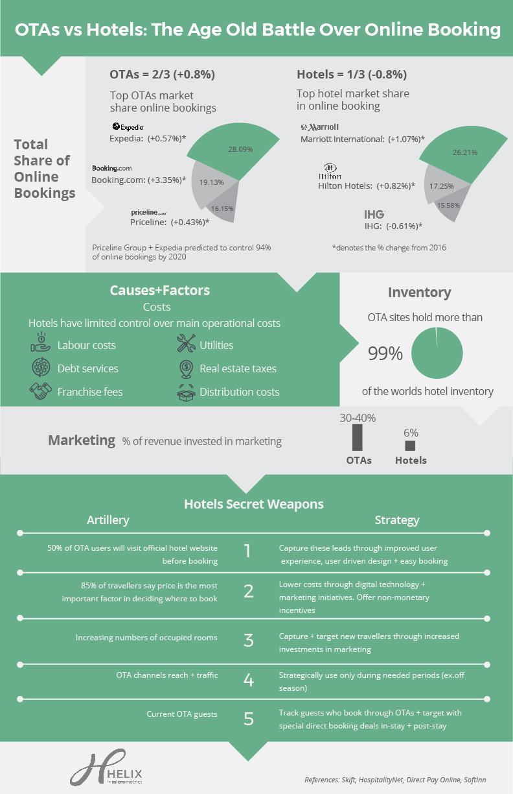
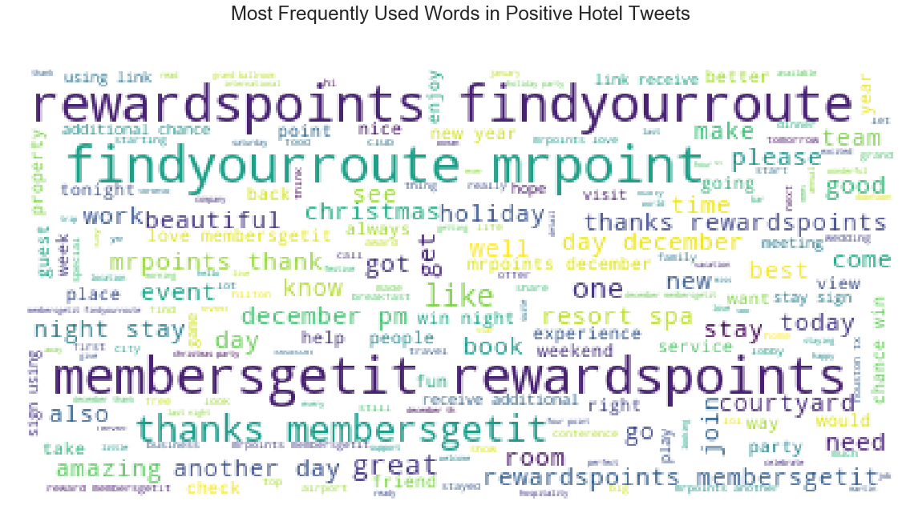
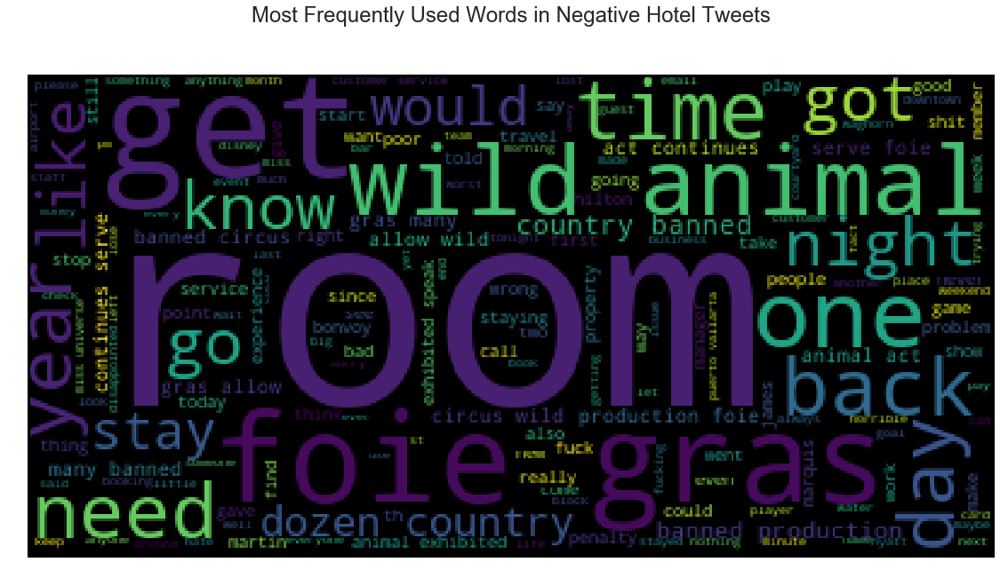
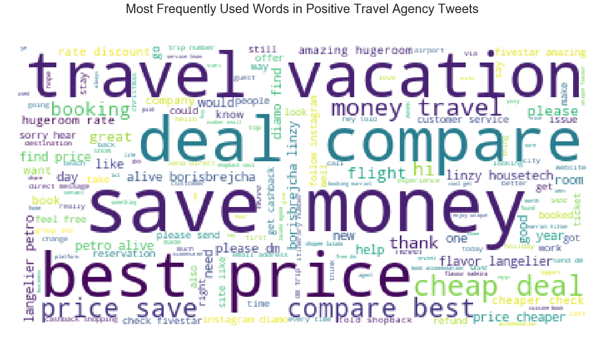
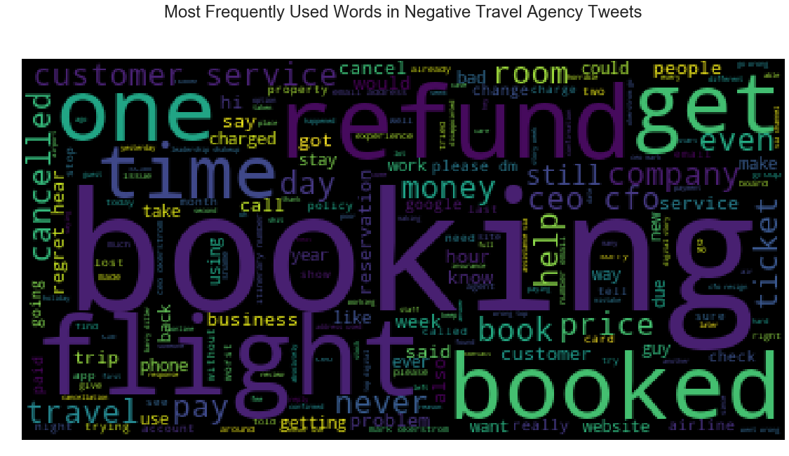
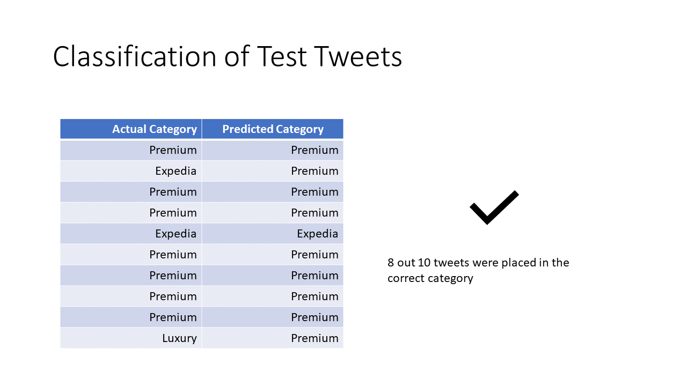

# Predicting Hotel Direct Booking Behavior

## Business Understanding

Over two thirds of all online hotel bookings are made through online travel agencies(OTAs), instead of being booked directly with the hotels themselves. Marriott Hotels make up the largest hotel group in the world (13.59% global market share) but only account for 26.21% of online hotel bookings. The top three online travel agencies by market share, Expedia, Booking.com and Priceline, account for 28.09%, 19.13%, 16.15% respectively. 

 

With respect to customer privcay, there are few public sources of information that can shed light on why customers overwhelmingly choose to book through online travel agencies, as opposed to booking directly with the hotel brands themselves. Twitter is increasingly used as a platform to both share opinions and receive customer service. 

The purpose of this project is to use information availble on twitter to determine why customers choose not to book directly with Marriott Hotels. A natural language processing model will be created to analyze tweets:

1. Sentiment Analysis
2. Predict Class of Tweet

With the outcome of the project, Marriott hotels will be able to:

1. Predict whether a customer will book with the hotel directly or the an OTA. 
2. Analyze misclassified tweets for markers as to why customers book through OTAs.

## Tweet Dataset
The Twitter API was used to gather 19,936 tweets over the course of 5 days. Tweepy was used in Python as an intermediary for Twitter. Tweets were gathered for 12 Marriott hotel brands. These brands were grouped into four categories:

**Luxury Hotels**
- St. Regis Hotels
- Ritz-Carlton Hotels
- JW Marriott Hotels
- W Hotels

Luxury hotels target top business executives, entertainment celebrities, high- ranking political figures, and wealthy clientele as their primary markets. They provide upscale restaurants and lounges, Valet, concierge services and also private dining facilities. 

**Premium Hotels**
- Westin Hotels
- Sheraton Hotels
- Renaissance Hotels
- Marriott Hotels

Hotels offering Premium or otherwise 3 to 4-star hotels service appeal the largest segment of the travelling public. This kind of hotels does not provide elaborate service and have a adequate staffing. They also provide uniformed service, food and beverage room service, in-room entertainment's and also Wi-Fi etc. 

**Select-Service Hotels**
- Springhill Suitts
- Courtyard by Marriott
- Fairfield Inn
- Residence Inn

These hotels provide clean, comfortable, safe, inexpensive rooms and meet the basic need of guests. Budget hotels appeal primarily to budget-minded travellers who want a room with minimum services and amenities required for the comfortable stay, without unnecessary paying additional cost for costly services.

Tweets from the top 3 Online Travel Agencies by market share were also obtained:

**Expedia**

Expedia.com is an online travel agency and metasearch engine. The website and mobile app can be used to book airline tickets, hotel reservations, car rentals, cruise ships, and vacation packages.

**Priceline**

Priceline.com is an online travel agency for finding discount rates for travel-related purchases such as airline tickets and hotel stays. The company facilitates the provision of travel services from its suppliers to its clients. 

**Booking.com**

Booking.com is a travel fare aggregator website and travel metasearch engine for lodging reservations. It is owned and operated by and is the primary revenue source of United States-based Booking Holdings. Booking.com is headquartered in Amsterdam.

The website has 28,425,726 listings in 148,470 destinations in 228 countries and territories worldwide. Each day more than 1,550,000 room nights are reserved on the website. The site is available in 43 languages. Its slogan is "Homes, houses and everything in between", although in commercials it is "Booking.com: Booking.yeah".

## Approach

1. Tweets obtained using Tweepy
    * Retweets were filtered during API calls

2. Tweets were then pre-processed
    * Sentiment was calculated using VADER
    * Tweets were cleaned
        * Stop words removed
        * Twitter handles removed
        * Numbers and emojis removed
        * Links were removed
        * All text made lower case
    * Tweets were tokenized
    * Tweets were lemmatized
    * Lemmatized tokens converted to a string
    
 

There were no missing values in the dataset. 

## Exploratory Data Analysis

 

The following figure shows that the most tweets were gathered for Marriott Premium hotels, while select-service hotels generate the fewest tweets.

 

We can see above the Distribution of Sentiment across all six classes of tweets. Luxury hotels have the strong positive sentiment at over 70% and the lowest negative sentiment at just over 7%. Expedia has the highest negative sentiment at more than 22%. 

 

The above figure shows the sentiment for Marriott hotels (positive to negative) plotted against subjectivity, whether a tweet is fact-based or opinion. The more objective a tweet, the more neutral the sentiment. Opinion-based tweets range widely from negative to positive but do show a trend towards positivity. 

 

The same is true for OTAs, as seen above. 

 

A word cloud was created to show the most common words in positive tweets about Marriott Hotels. The most common theme is membership rewards. There is no strong positive message occuring in these tweets. 

 

A word cloud showing common words in negative tweets reveals that rooms is a recurring theme. Interestingly, foie gras and wild animal are the next most prevalent words in the negative tweets. 

 

A word cloud of positive OTA tweets shows consistent themes emerging: save money, best deal, travel. This is strong, consistent and positive.

 

Negative tweets about OTAs reflect consist trouble booking, along with refunds and flights. 

## Modeling Data
The data was split into training and validation sets for modeling. So that text data can be interpreted during modeling, it was vectorized, or transformed into an array of numbers. Two methods of vectorizatin were used:

**Count Vectorization**
In this method, words are counted and then this count is used to assign each word a weight in the dataset. 
**TF_IDF Vectorization**
Thi method assigns words a value of importance to each word to help the model know if a word is important to interpretation.

Three classification models were built and cross-validated using GridSearchCV. Stratified K Fold with shuffle was used to validate models and best parameters. 
    - Random Forest
    - Multinomial Naïve Bayes
    - Multinomial Logistic Regression
    
Each model was created after training using both the TF_IDF and Count Vectorized data sets. The best performing model selected using accuracy score.

**Multinomial Logistic Regression** had an accuracy of **83.2%**. This model was selected and evaluated. The model was retrained using the following parameters identified through GridSearchCV:

Best Model Parameters:

* **C: 2
* **Solver**: Newton-cg
* **Class_Weight**: None
* **Dataset**: TF_IDF

## Model Performance

To evaluate model performance, ten tweets were randomly selected and fit into the model to see how they were classified. The original tweets and classifications were retrieved for comparison. The model correctly classified 8 out of 10 of the tweets selected. This is in line with its 83.2% accuracy during modeling. 

 

## Recommendations
The model can be used to accurately predict whether a user will book with Marriott Hotels directly or with one of the Top 3 Online Travel agencies. Misclassified tweets can also be scrutinized to determine future areas of focus for brand messaging and customer service.

## Future Work
1. Create clear tweet labels to improve customer service
2. Analyze tweets to design positive, consistent brand message
3. Conduct analysis of Membership rewards, as it's the strongest positive message in tweets.

## Files

- README.md: Instruction guide
- Get Tweets.ipynb : a jupyter notebook file
- Clean Hotel Tweets.ipynb : a jupyter notebook file
- Clean OTA Tweets.ipynb : a jupyter notebook file
- Exploratory Data Analysis.ipynb : a jupyter notebook file
- Supervised Machine Learning Models-Predict Booking.ipynb : a jupyter notebook file
- Interpreting The Final Model.ipynb : a jupyter notebook file
- hotel_tweets.csv : Contains tweets about Marriott Hotels gathered using Tweepy
- ota_tweets.csv : Contains tweets about Expedia, Priceline and Booking.com gathered using Tweepy
- all_hotels.pkl: Pickle file with all cleaned hotel tweets
- all_otas.pkl: Pickle file with all cleaned OTA tweets
- all_data.pkl: Pickle file with combined hotel and OTA tweets
- log_reg.pkl: Pickle file with final Multinomial Logistic Regression model
- X_test.pkl: Pickle file with validation set of tweets
- y_test.pkl: Pickle file with validation set of classes
- tf_idf_X_test.pkl: Pickle file containing vectorized validation tweets
- Predicting Direct Booking Behvior.pdf: presentation slides that hightlight the results from this project
- cf_matrix.py: file containing function to make plot an sklearn Confusion Matrix cm using a Seaborn heatmap visualization

## Requirements

In order to run the code in the jupyter notebook, you must have Python installed on you computer. Use Anaconda, as it had many useful libraries pre-installed. 

## Installation

Import the following libraries:

```python
import pandas as pd
import numpy as np
import matplotlib.pyplot as plt
%matplotlib inline
import seaborn as sns
plt.style.use('seaborn')

import tweepy
import json

import joblib
import pickle

from nltk.sentiment.vader import SentimentIntensityAnalyzer
from textblob import TextBlob

import re 
from string import punctuation
import nltk
from nltk.corpus import stopwords
from string import punctuation
from nltk import word_tokenize
from nltk.stem.wordnet import WordNetLemmatizer

import wordcloud
from wordcloud import WordCloud,STOPWORDS
from PIL import Image

from nltk import ngrams

import plotly_express as px
import plotly.graph_objects as go

import cufflinks as cf
cf.go_offline()
cf.set_config_file(offline=False, world_readable=True)

from sklearn.feature_extraction.text import CountVectorizer, TfidfVectorizer

from sklearn.linear_model import LogisticRegression
from sklearn.naive_bayes import MultinomialNB
from sklearn.ensemble import RandomForestClassifier

from sklearn.model_selection import train_test_split, GridSearchCV, cross_val_score, StratifiedKFold

from sklearn.metrics import confusion_matrix,classification_report

from cf_matrix import make_confusion_matrix

import warnings
warnings.filterwarnings("ignore")
```
